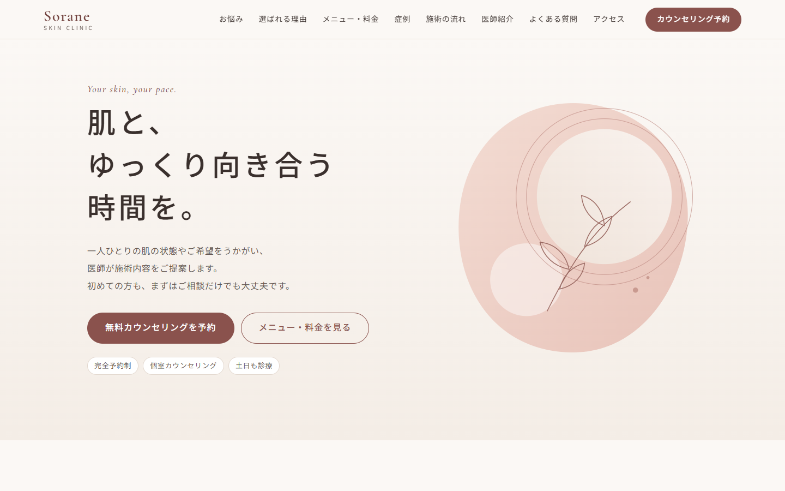
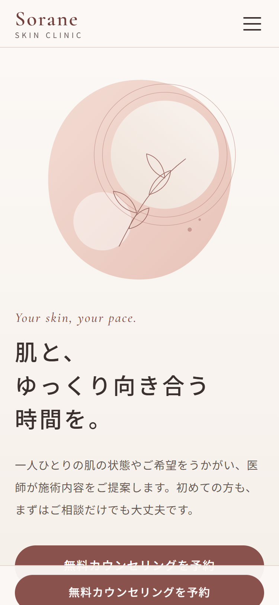

# Sorane Skin Clinic — 美容クリニック LP（コーディングサンプル）

架空の美容皮膚科「Sorane Skin Clinic（ソラネ スキンクリニック）」のランディングページを、デザインからコーディングまで1ページ制作した自主制作サンプルです。
クリニック名・医師・住所・電話番号・料金はすべて架空のもので、実在の施設とは関係ありません。

- **公開 URL**：https://yunon20020511-hash.github.io/portfolio-beauty-lp/
- **制作時間**：デザインから検証まで 1 日以内（表示確認・Lighthouse 計測・W3C 検証を含む）

| PC（1440px） | スマートフォン（375px） |
| --- | --- |
|  |  |

全体のスクリーンショット：[PC](screenshots/pc-full.png)／[スマートフォン](screenshots/sp-full.png)

## 使用技術

- HTML5（セマンティックなマークアップ）
- CSS3（Flexbox／Grid、カスタムプロパティ、`clamp()` による可変フォントサイズ）
- JavaScript（バニラ JS。jQuery・フレームワーク不使用）
- Google Fonts：Noto Sans JP、Cormorant Garamond
- 制作支援：Claude Code

## ページ構成

1. ヘッダー（ロゴ、ナビ、予約ボタン。スマートフォンではハンバーガーメニュー）
2. メインビジュアル
3. こんなお悩みはありませんか
4. 当院が大切にしていること（3つの理由）
5. 施術メニューと料金（表）
6. 症例紹介（ビフォーアフター枠はダミー表示）
7. 施術の流れ（5ステップ）
8. 医師紹介
9. よくある質問（アコーディオン）
10. アクセス・診療時間
11. 予約 CTA・フッター
12. スマートフォン・タブレットでは画面下に予約ボタンを固定表示

## 工夫した点

### デザインの再現度
- 余白は 8px 単位でそろえ、見出し・本文・注記の文字サイズと行間を役割ごとに統一しました。
- 色・余白・フォントは CSS カスタムプロパティにまとめ、デザインの修正があっても一か所で直せる構成にしています。

### レスポンシブ対応
- モバイルファーストで、768px（タブレット）と 1024px（PC）で切り替えています。
- 375px／768px／1440px で表示崩れと横スクロールがないことを確認しました。
- 料金表は PC では表、スマートフォンでは施術ごとのカード表示に切り替わり、狭い画面でも横スクロールなしで読めます（HTML は `table` のまま）。
- 施術の流れは、PC では横並び、スマートフォンでは縦並びの矢印つきステップ表示です。

### アニメーション
- スクロールに合わせて各要素がふわっと表示されます（IntersectionObserver を使用。並んだ要素は少しずつ時間をずらして表示）。
- よくある質問は、高さがなめらかに変わるアコーディオンです。
- スマートフォンの固定予約ボタンは、メインビジュアルを過ぎたら表示し、予約セクションが見えている間は隠します。
- OS の設定でアニメーションを減らしている場合（prefers-reduced-motion）は、動きを止めます。

### アクセシビリティ
- `header`／`nav`／`main`／`section`／`footer` と、h1 から h3 までの見出し階層で構成しています。
- 画像にはすべて代替テキストを付けています（ダミー画像はダミーであることも明記）。
- ハンバーガーメニュー：キーボードで開閉でき、開いている間はフォーカスがメニュー内にとどまり、Esc キーで閉じます。`aria-expanded` で開閉状態を読み上げます。
- アコーディオン：`button` 要素で作り、Enter／Space キーで開閉できます。閉じている回答は読み上げ・フォーカスの対象から外しています。
- 「本文へスキップ」リンク、フォーカス時の枠線表示、文字と背景のコントラスト比（WCAG AA）に対応しています。
- JavaScript が無効でも、本文の内容はすべて表示されます。

### 表示速度（Lighthouse）
- 和文フォントは通常 40 前後のファイルに分かれて読み込まれ、スマートフォンでの表示が遅くなる原因になっていました（初回計測でモバイルの Performance が 56）。
- ページで使っている文字だけを含むフォントを Google Fonts から取得し、サイト内から配信する方法に変えました。和文フォントは 1 ファイル（約160KB）になり、先読み（preload）も指定しています。取得は `tools/build_fonts.py` で自動化しています。
- 画像はすべて SVG で作り、軽くしています。

| 項目 | モバイル | PC |
| --- | --- | --- |
| Performance | 97 | 100 |
| Accessibility | 100 | 100 |
| Best Practices | 100 | 100 |
| SEO | 100 | 100 |

※ 公開 URL を Lighthouse 12（Chrome）で計測した値です（2026年10月8日）。

### HTML の妥当性
- W3C Markup Validation Service（Nu Html Checker）で、エラー・警告ともに 0 件です。

### 医療広告ガイドラインへの配慮
- 「必ず」「最高」「No.1」などの誇大な表現と、患者の体験談は使っていません。
- 症例には、施術内容・回数・費用・主なリスクと副作用を併記しています。症例写真の枠はダミー表示です。
- 料金は税込で表示し、自由診療であることを明記しています。

## ファイル構成

```
portfolio-beauty-lp/
├── index.html
├── css/
│   ├── style.css       … レイアウト・デザイン
│   └── fonts.css       … フォント定義（tools/build_fonts.py で生成）
├── js/main.js          … メニュー・アコーディオン・スクロール表示・固定ボタン
├── fonts/              … Web フォント（使用文字のみ）とライセンス
├── img/                … SVG 画像（自作）
├── screenshots/        … スクリーンショット
└── tools/build_fonts.py
```

文言を変更したときは、`python tools/build_fonts.py` を実行してフォントを作り直します（追加した文字がフォントに含まれるようにするため）。

## 素材・出典

- **画像**：メインビジュアル、アイコン、医師のイラスト、地図、ファビコンはすべて SVG／CSS で自作したものです。外部の写真素材は使っていません。症例写真はダミー表示です。
- **フォント**：Google Fonts の [Noto Sans JP](https://fonts.google.com/noto/specimen/Noto+Sans+JP) と [Cormorant Garamond](https://fonts.google.com/specimen/Cormorant+Garamond)。どちらも SIL Open Font License 1.1 で、ライセンス文を `fonts/` に同梱しています。

---

※本サイトは架空のクリニックを題材にした自主制作サンプルです。
